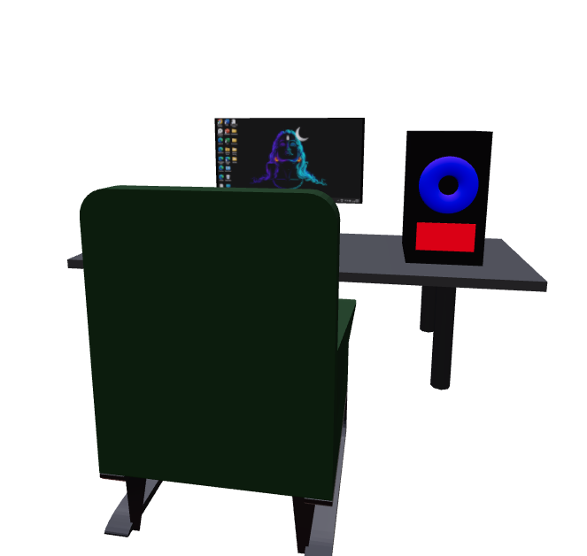

# 💼 Mahadev Kumar's Developer Portfolio

Welcome to my personal portfolio website — a showcase of my journey, skills, projects, and passion for full-stack web development. Built with modern web technologies to reflect my commitment to quality, design, and performance.

## 🚀 Tech Stack

- **Frontend:** React.js, Tailwind CSS, Framer Motion
- **3D Rendering:** Three.js with React Three Fiber & Drei
- **Animations:** Framer Motion, GSAP (where needed)
- **Deployment:** Vercel / Netlify (choose the one you used)

## 📂 Project Structure


## ✨ Features

- 🎨 Responsive, animated layout using Tailwind CSS and Framer Motion
- 🖥️ Interactive 3D computer setup using React Three Fiber
- 📜 About, Skills, Education, Certificates, and Projects sections
- 🌙 Dark theme-friendly visuals
- 🖱️ Hover and scroll interactions
- 📱 Mobile and tablet optimized

## 🧠 What I Learned

- Advanced 3D modeling and scene control in React
- Smooth animation management using Framer Motion
- Responsive design with Tailwind utilities
- Component-driven development and performance optimization

## 🔗 Live Preview

[👉 View Portfolio Live](https://mahadev422.github.io/Portfolio/)

## 🖼️ Screenshots

| 3D Section |
|  |

## 🛠️ Setup Instructions

```bash
# Clone this repo
git clone https://github.com/your-username/portfolio.git
cd portfolio

# Install dependencies
npm install

# Start development server
npm run dev
